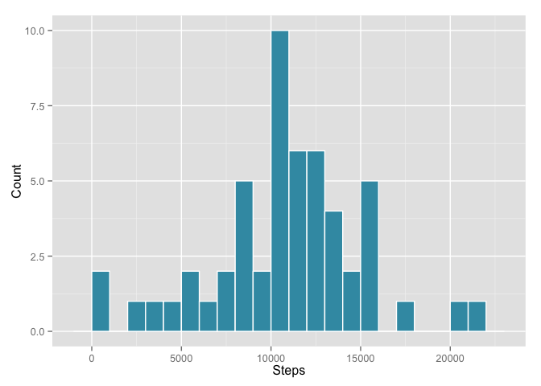
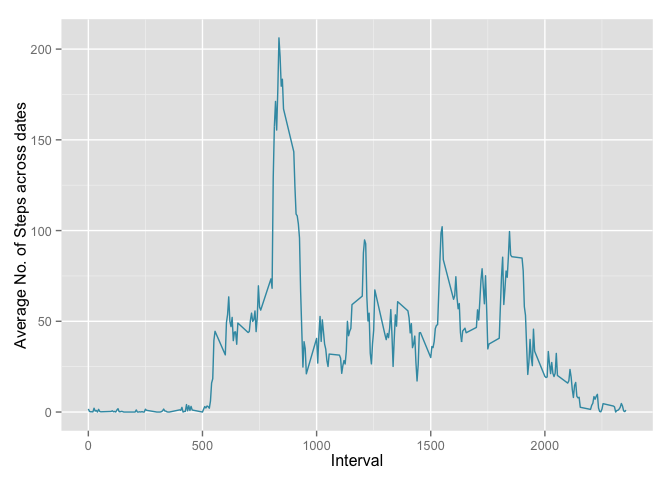
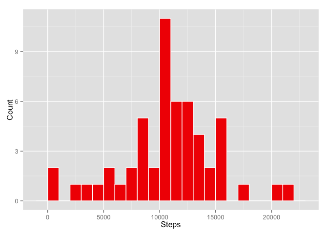
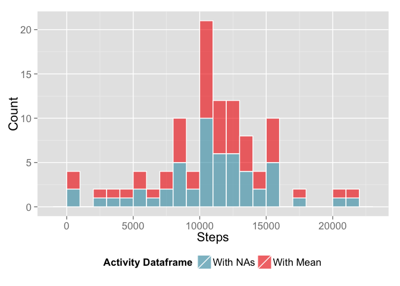
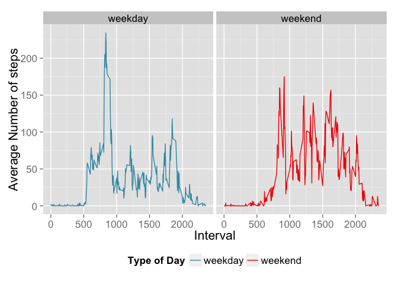

# Reproducible Research: Peer Assessment 1

This assignment makes use of data from a personal activity monitoring device. This device collects data at 5 minute intervals through out the day. The data consists of two months of data from an anonymous individual collected during the months of October and November, 2012 and include the number of steps taken in 5 minute intervals each day.

## Loading and preprocessing the data

We start by loading the R libraries that we will be using:


```r
library("lubridate") # datetime parsing made easy
library("ggplot2")
library("wesanderson") # colour palettes
library("reshape") 
```

`Lubridate` will be used to parse the datetime objects. `ggplot2` will be used for plotting, together with the `wesanderson` palettes. Finally the `reshape`library will be used to reshape data. We finish setting up the environment and load the data:


```r
# Colour palettes
pal <- wes.palette(name = "Zissou", type = "continuous")

# Local directory
setwd("~/Documents/Various R/RepData_PeerAssessment1")

# Read data
activity <- read.csv("activity.csv")
```

## What is mean total number of steps taken per day?

We start by making a histogram of the total number of steps taken each day. For this we create a dataframe
which contains no NAs and an auxiliary dataframe that aggregates the data by date:


```r
activity_cl<-activity[complete.cases(activity),]
aux1<-aggregate(steps ~ date, data = activity_cl, sum)
```

Here we have the histogram of the total number of steps taken daily, using a bin of 1000 steps. 


```r
ggplot(aux1, aes(x=steps)) + geom_histogram(fill = pal(2)[1],colour="white", stat="bin", binwidth=1000)  + 
  xlab("Steps") + ylab("Count")
```

 


For the number of steps taken per day we have a mean of 1.0766 &times; 10<sup>4</sup> and a median of 10765.


## What is the average daily activity pattern?

We start by making a time series plot of the 5-minute intervals vs. the average number of steps taken, averaged across all days. For
that we generate an auxiliary dataframe aggregating the data:

```r
aux2<-aggregate(steps~interval, data=activity, mean)
ggplot(data=aux2, aes(x=interval, y=steps, group=1)) + geom_line(colour=pal(2)[1]) +
  xlab("Interval") + ylab("Average No. of Steps across dates")
```

 


The 5-minute interval that contains the maximum number of steps is the 835.

## Imputing missing values

There are a number of days/intervals where there are missing values, and can introduce bias into some calculations or summaries of the data.
Let us estimate the number of missing values in the dataset for each feature variable>


```r
sum(is.na(activity$steps)) # Steps column
```

```
## [1] 2304
```

```r
sum(is.na(activity$date)) # Date column 
```

```
## [1] 0
```

```r
sum(is.na(activity$interval)) # Interval column
```

```
## [1] 0
```

A way of dealing with the missing values in the steps column is to replace the value by the average value for that interval:


```r
# Function to replace NA in steps for a given interval by the average number of steps for that interval:
value_fill <- function(df){
  df_aux <- aggregate(steps~interval, data=df, mean)
  df$steps<-ifelse(is.na(df$steps), round(df_aux[df_aux$interval == df$interval,2],0) , df$steps )
  return(df)
}

# New dataset that is equal to the original dataset but with the missing data filled in.
activity_new<-value_fill(activity)
```

Let us compare the first rows of the original dataset and the new dataset:

```r
head(activity) # Original Dataset
```

```
##   steps       date interval
## 1    NA 2012-10-01        0
## 2    NA 2012-10-01        5
## 3    NA 2012-10-01       10
## 4    NA 2012-10-01       15
## 5    NA 2012-10-01       20
## 6    NA 2012-10-01       25
```

```r
head(activity_new) # New Dataset
```

```
##   steps       date interval
## 1     2 2012-10-01        0
## 2     0 2012-10-01        5
## 3     0 2012-10-01       10
## 4     0 2012-10-01       15
## 5     0 2012-10-01       20
## 6     2 2012-10-01       25
```

We now make an histogram of the total number of steps taken each day, using the new dataset: 


```r
aux3<-aggregate(steps ~ date, data = activity_new, sum) # auxiliary dataframe aggregating data
ggplot(aux3, aes(x=steps)) + geom_histogram(fill = pal(2)[2],colour="white", stat="bin", binwidth=1000)  + 
  xlab("Steps") + ylab("Count")
```

 


For the number of steps taken per day with this new dataset, we have a mean of 1.0766 &times; 10<sup>4</sup> and a median of 1.0764 &times; 10<sup>4</sup>.

To observe if there are difference on the estimates from the first part of this assignment, let us plot the histograms together:


```r
aux4<-merge(aux1,aux3,by="date", all=TRUE) # merge old a new datasets by date
aux4<-melt(aux4, id="date") # reshape to long form for plotting
ggplot(aux4, aes(x=value, fill=variable)) + geom_histogram(stat="bin", alpha=0.6, binwidth=1000, colour="white")  + 
  xlab("Steps") + ylab("Count") + 
  scale_fill_manual(values = pal(2),name="Activity Dataframe",labels=c("With NAs", "With Mean")) +
  theme(text = element_text(size=16), legend.position="bottom")
```

 


## Are there differences in activity patterns between weekdays and weekends?

To answer this question, let us create a new factor variable with two levels – “weekday” and “weekend” indicating whether a given date is a weekday or weekend day:

```r
activity$dow<-ifelse(wday(activity$date, label=TRUE)=="Sat" | wday(activity$date, label=TRUE) =="Sun"  , "weekend", "weekday")
```

We now generate the same time series as before (intervals vs average number of steps taken), but faceted by the type of day of the week:

```r
aux5<-aggregate( steps ~ interval + dow, data=activity, mean)

ggplot(aux5, aes(x = interval, y = steps, colour=dow)) + geom_line() + 
  facet_grid(.~dow) + labs(x = "Interval", y = "Average Number of steps") +
  theme(text = element_text(size=16), legend.position="bottom") + 
  scale_colour_manual(values=pal(2), name="Type of Day")
```

 

As the figure above shows, the activity on the weekends is more pronounced than on weekdays. It is fair to assume that this might be due to the fact
that on weekdays the individual might be working, so he/she might have less opportunity to walk.
